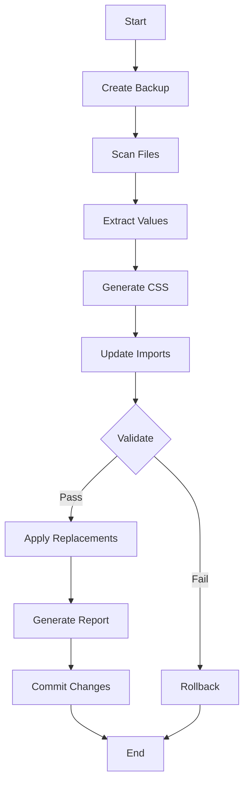

# Safe Migration Extraction System

## Overview

The Safe Migration Extraction system is designed to replace hardcoded values with CSS variables **without breaking the UI**. It ensures that all temporary tokens are properly defined before any replacements are made.

## Key Improvements Over Original System

### 1. **CSS Definition Generation**
- Creates `styles/migration-tokens.css` with all temporary token definitions
- Ensures every `var(--temp-*)` reference has a corresponding CSS variable

### 2. **Import Management**
- Automatically adds import to `globals.css`
- Verifies the import is working before proceeding

### 3. **Validation Before Replacement**
- Validates all CSS tokens are defined
- Only proceeds with replacements after validation passes

### 4. **Rollback Capability**
- Creates backup git commits
- Provides easy rollback command if issues occur

## Usage

### Running Safe Extraction

```bash
npm run migrate:extract:safe
```

### What Happens During Extraction

1. **Backup Creation**
   - Creates a git commit before any changes
   - Saves commit hash for easy rollback

2. **Discovery Phase**
   - Scans all relevant files
   - Identifies hardcoded values
   - Does NOT modify files yet

3. **CSS Generation**
   - Creates `styles/migration-tokens.css`
   - Defines all temporary tokens with original values
   - Example:
     ```css
     :root {
       /* Color Tokens */
       --temp-color-1: #7B00FF; /* 5 usages */
       --temp-color-2: #F5F5F7; /* 3 usages */
       
       /* Spacing Tokens */
       --temp-spacing-1: 24px; /* 8 usages */
       --temp-spacing-2: 16px; /* 12 usages */
     }
     ```

4. **Import Update**
   - Adds import to `app/globals.css`:
     ```css
     @import "tailwindcss";

     /* Temporary migration tokens */
     @import "../styles/migration-tokens.css";
     ```

5. **Validation**
   - Verifies CSS file exists
   - Checks import is present
   - Ensures all tokens are defined

6. **Safe Replacement**
   - Only after validation passes
   - Replaces hardcoded values with CSS variables
   - Example transformations:
     ```tsx
     // Before
     <div className="bg-[#7B00FF]" />
     
     // After
     <div className="bg-[var(--temp-color-1)]" />
     ```

7. **Report Generation**
   - Creates detailed migration report
   - Includes rollback instructions
   - Lists all extracted values

## File Structure

```
vergil-design-system/
├── styles/
│   └── migration-tokens.css      # Generated CSS with temp tokens
├── app/
│   └── globals.css              # Updated with import
├── reports/
│   ├── migration-discovery.json # Detailed extraction data
│   └── migration-discovery-summary.md # Human-readable summary
└── scripts/
    └── migration/
        └── migration-extract-safe.ts # Safe extraction script
```

## Rollback Process

If something goes wrong, rollback is simple:

```bash
# Check the backup commit hash in the report
cat reports/migration-discovery-summary.md

# Rollback to backup
git reset --hard <backup-commit-hash>
```

## Testing the System

Run the test script to verify everything works:

```bash
tsx scripts/migration/test-safe-extraction.ts
```

This will:
1. Create a test component with hardcoded values
2. Run safe extraction
3. Verify CSS was generated
4. Verify imports were added
5. Verify replacements were made
6. Clean up test files

## Next Steps After Extraction

1. **Review Generated Tokens**
   - Check `styles/migration-tokens.css`
   - Verify all values look correct

2. **Run Migration Review**
   ```bash
   npm run migrate:review
   ```

3. **Map to Semantic Names**
   - Replace temp names with meaningful ones
   - Example: `temp-color-1` → `brand-purple`

4. **Validate and Apply**
   ```bash
   npm run migrate:validate
   npm run migrate:apply
   ```

## Benefits

1. **Zero Downtime** - UI never breaks during migration
2. **Fully Reversible** - Easy rollback with git
3. **Transparent Process** - See exactly what will change
4. **Incremental Migration** - Can be done in stages
5. **Validation First** - Catches issues before they happen

## Common Issues and Solutions

### Issue: CSS file not found
**Solution**: Ensure the `styles/` directory exists

### Issue: Import not working
**Solution**: Check the relative path in globals.css import

### Issue: Some values not replaced
**Solution**: Check if values are in the exceptions list

### Issue: Build errors after migration
**Solution**: Use the rollback command and check error messages

## Configuration

The safe extractor respects these configurations:

- **File Extensions**: `.ts`, `.tsx`, `.css`, `.scss`, `.js`, `.jsx`
- **Ignored Directories**: `node_modules`, `.next`, `dist`, `build`
- **Exception Values**: `transparent`, `currentColor`, `0`, `auto`, etc.
- **Token Prefix**: `temp-` (will be replaced in review phase)

## Architecture



## Best Practices

1. **Always Review First**
   - Check the generated CSS before proceeding
   - Verify token counts match expectations

2. **Test on Feature Branch**
   - Don't run on main/master directly
   - Create a feature branch first

3. **Incremental Migration**
   - Can run on specific directories
   - Migrate one module at a time

4. **Monitor Performance**
   - Large codebases may take time
   - Watch for memory usage

5. **Keep Backups**
   - Note the backup commit hash
   - Consider additional backups for critical projects